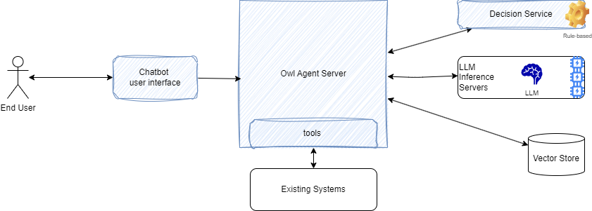

# Anatomy of a solution

This chapter presents the high level concepts and constructs of the Owl Agent framework and how it is used in the context of a custom solution.

**Agent** is a deployable unit built up by choreographing one or more _llm_, each with its own workflow that can leverage external _tools_, and guided by _prompts_.

A typical solution includes: **1/** a front end to let a human interact with the system, **2/** a backend to manage the life cycle of agents integrated with a LLM running as a service, with dynamic integration to tools and functions, vector store retrievers, and decision services. **3/** Decision service with inference rules to control the decision to be made.

**4/** The conversation is stateful, persisted and integrated with the different agents defined in the solution. 

The **Owl Agent backend** may manage multiple concurrent conversations and multiple agents instances. It can scale horizontally too. 

## Key concepts

The main concepts the framework defines and uses are:

* An _Agent_ manages a co-ordinated set of calls to a Large Language Model,  with a prompt and tools, to accomplish a subtask.
* **Prompts**, are `System prompts` in the Generative AI context. They define what the LLM should do

The following diagram presents, one agent that integrate one LLM, with a set of tools. One tool is helping to access a client given its name, queries a database, one tool is to compute the next best action is send structured data to a decision service, to get better decsion, and finally one is a retriever to access collections in a vector database to support Retrieved Augmented Generation use cases.

{ width=900 }

Tools can  be any python function, ot proxies to remote business service.

### Agents

An _agent_ is an interactive application or solution that supports a specific business use case, like helping a worker performing a specific task of a business process.  The execution of the agent involves the coordination of one or more LLMs.  Agents may be stateful to preserve the state of a conversation using snapshot capabilities. 

Agent management has two parts: 1/ the management of the OwlAgent entity definitions with REST resources and a persistence repository, and 2/ the agent runner instance which manages conversations:

In any solution the conversation manager service use one agent runner.

### Promps
### Documents
### Tools
### Agentic workflow

## A customizable agent backend

### Backend APIs
### Hooks to custom code

Some text here

## An out-of-the-box chatbot frontend webapp

## How the frontend and backend work together

